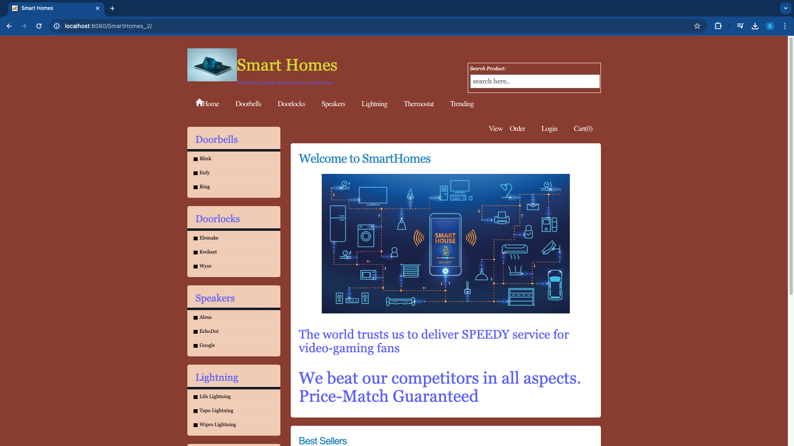

# Smart Homes
Smart Homes is a e-commerce application where users can create and login into their accounts to buy products that make their home smart. This website handles three roles - Customer, Manager, Salesman (each have their own set of features). Apart from this users can also view Trending products which has three categories - Best Products, Most Sold Products by Zipcode, Most Sold Products. User can also add their reviews to the products and these reviews will be stored in MongoDB Database.

   </a>

### Steps to run this application on local machine (macOS)
    1. Start Tomcat Server
    2. Start MongoDB Server
    3. Start MySQL Server
    4. Hit http://localhost:8080/SmartHomes_2/ 